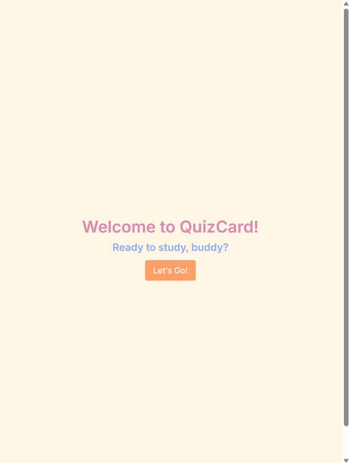
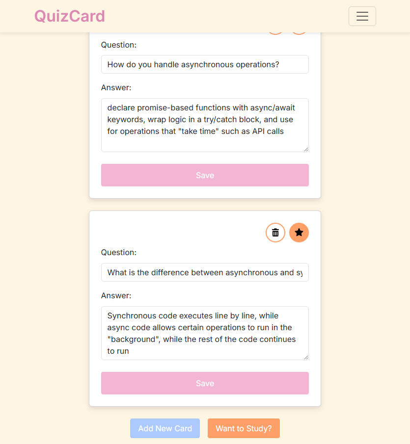
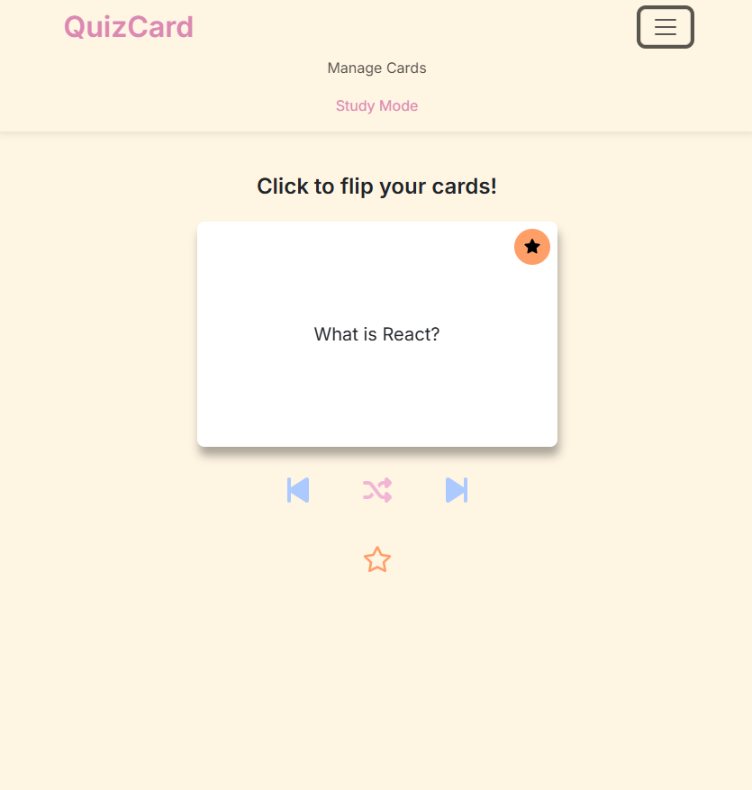
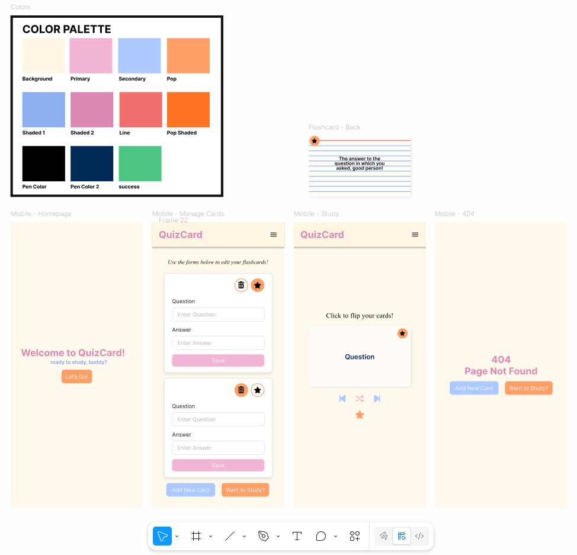

# QuizCard 

**QuizCard** is a web application designed to help users create, manage, and study digital flashcards for efficient learning. Users can focus on key concepts by marking cards as “starred” and enjoy an interactive study experience with a clean, responsive interface.

visit QuizCard here: [Deployed QuizCard App](https://quiz-card.netlify.app/)

## Table of Contents

- [Features](#features)
- [Technologies](#technologies)
- [Getting Started / Local setup](#getting-started--local-setup)
- [Usage](#usage)
- [Demo](#demo)
- [Screenshots](#screenshots)
- [Figma Design](#figma-design)
- [Contributors](#contributors)
- [License](#license)

---

## Features

* **Flashcard Management:** Create, edit, and delete flashcards for any topic.  
* **Focused Study:** Star important cards to review only key concepts in a dedicated study session.  
* **Interactive Study Mode:** Flip cards to see questions and answers, with navigation and shuffle options for varied practice.  
* **Persistent Data:** Flashcards are saved in local storage for a seamless experience across sessions.  
* **Responsive Design:** Works on both desktop and mobile devices for flexible studying anywhere.

---

## Technologies

**This web application is built with:**  

[React](https://reactjs.org/) – JavaScript library for building user interfaces.<br>
[React Router DOM](https://reactrouter.com/) – Client-side routing for React.<br>
[Bootstrap](https://getbootstrap.com/) – CSS framework for responsive design.<br>
[React Bootstrap](https://react-bootstrap.netlify.app/) – The most popular front-end framework, rebuilt for React.<br>
[Local Storage](https://developer.mozilla.org/en-US/docs/Web/API/Window/localStorage) – Persistent client-side data storage.<br>

*(Future version will integrate a Node.js backend for persistent storage and user accounts.)*

---

## Getting Started / Local Setup

Follow these steps to run QuizCard locally on your machine:

1. **Clone the repository:**
   ```bash
   git clone https://github.com/<your-username>/quizcard.git
   cd quizcard
2. **Install dependencies:**
    ```bash
    npm install
3. **Start the development server:**
    ```bash
    npm run dev
---

## Usage

Visit the [Deployed Site](#)

1. **Manage Cards:** Add, edit, or delete flashcards using the Manage Cards page.  
2. **Star Cards:** Click the ★ button on any card to mark it as important for focused review.  
3. **Study Mode:** Review your flashcards in Study Mode. Click a card to flip between question and answer, use the arrows to navigate, or shuffle cards for varied practice.  
4. **Focused Study:** Toggle “Starred Only” to study only the cards marked as important.  

---

## Demo

**Manage Cards**: 
*create, update, delete, and "favorite" cards in the Manage Cards page.*

  

**Study Mode**:
*Flip, navigate through, shuffle, and focus on cards in Study Mode.*

  

---

## Screenshots

### Landing Page


### Manage Cards Page


### Study Mode Page


### Error Page


---

## Figma Design



---

## Contributors

[Thomas Dossman](https://github.com/Dossman-thomas) – Frontend Developer / Project Lead  


---

## License

QuizCard is licensed under the [MIT License](https://opensource.org/licenses/MIT)
